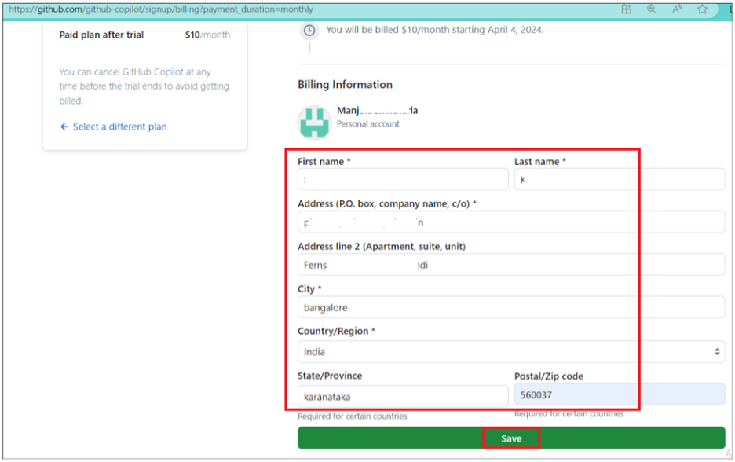
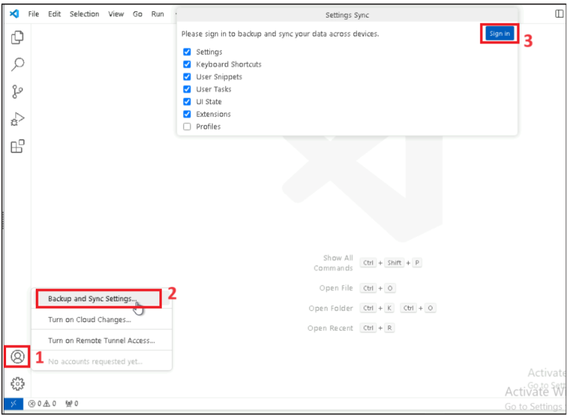
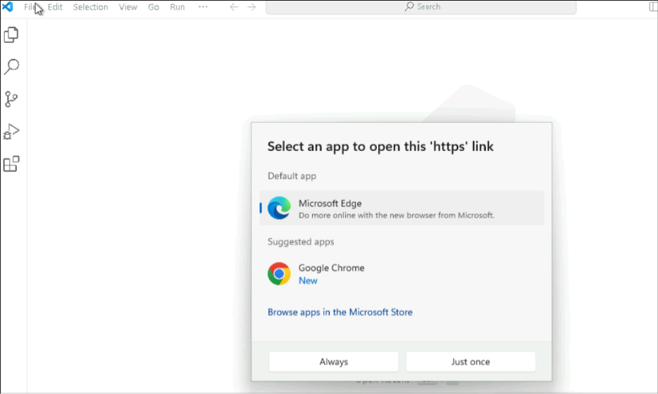
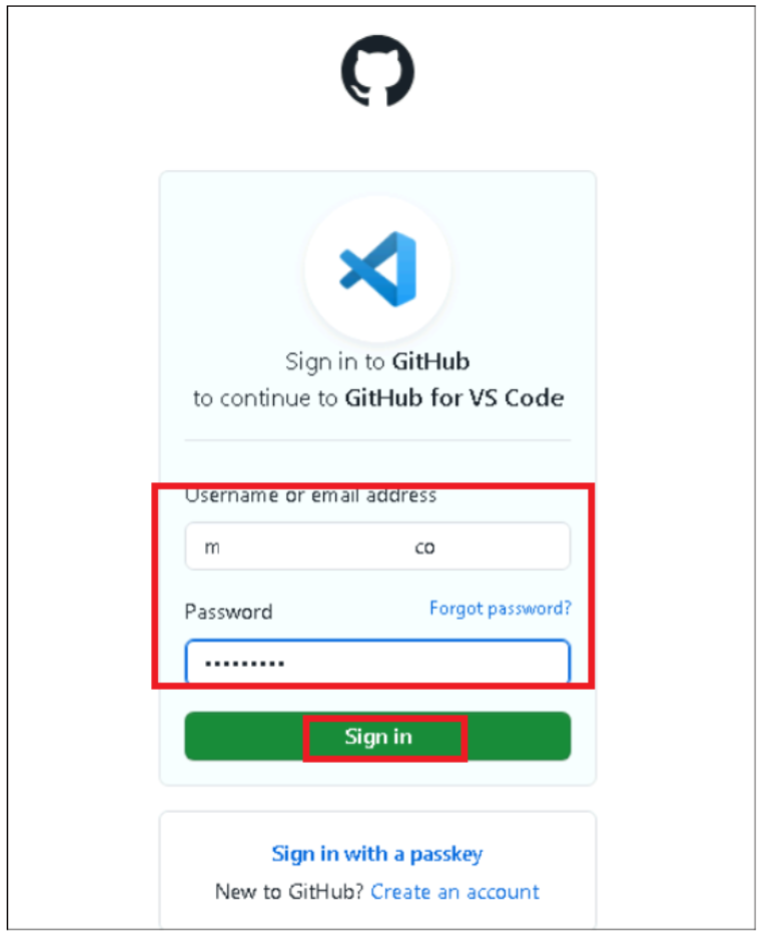
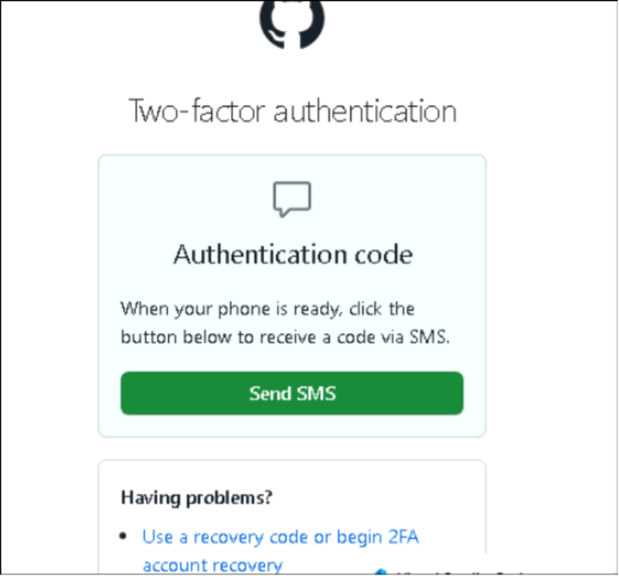
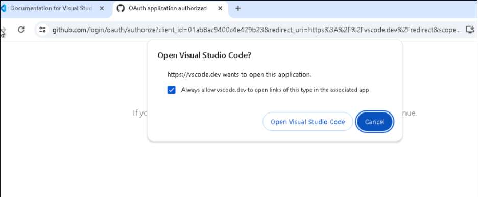

---
lab:
  title: 'Lab 0: Activate and Configure GitHub Copilot Subscription'
  description: In this lab, you will activate GitHub Copilot and configure it within Visual Studio Code to enable AI-assisted software development. You will sign in with your GitHub account, authenticate your access, and install the GitHub Copilot Chat extension in VS Code. This setup prepares your development environment for upcoming labs focused on code generation, productivity, security, and DevOps automation using GitHub Copilot.
  duration: 30 minutes
  level: 100
  islab: true
  primarytopics:
    - GitHub
    - Visual Studio
    - Visual Studio Code
---

# Lab 0: Activate and Configure GitHub Copilot Subscription**

In this lab, you will activate GitHub Copilot and configure it within
Visual Studio Code to enable AI-assisted software development. You will
sign in with your GitHub account, authenticate your access, and install
the GitHub Copilot Chat extension in VS Code. This setup prepares your
development environment for upcoming labs focused on code generation,
productivity, security, and DevOps automation using GitHub Copilot.

**Note: GitHub Copilot Free is available without a credit card and provides limited code completions, chat, and agent-mode usage. You may use the Free plan for this lab if you do not want to associate a payment method. A paid Copilot plan provides higher usage limits and additional models. Do not activate a paid subscription unless you are comfortable with the applicable charge.** 

**Note:** This lab is intended only for users who have not yet activated
or configured GitHub Copilot. If your setup is already complete, you may
skip these steps.

1.  Open a new tab in your browser and go to Signup to GitHub Copilot
    - +++https://github.com/github-copilot/signup+++

2.  Click on the "**Get access to GitHub Copilot”** button. 

    

3.  Enter billing information with your personal credit card and
    then click on **Save**. 

    

4.  Enter your billing information and then click on the **Save payment
    information** button. 

    

    **IMPORTANT:** Make sure to deactivate the account after you complete
    the labs to avoid billing for usage. 

5.  Open Visual Studio Code from the Windows Start menu.
    Click on **Accounts -\> Backup and Sync Settings** and select **Sign
    in.** 

    

6.  Select the **Sign in with GitHub** option.

    

7.  Select the Browser and Sign in with your Copilot enabled Github account. 

    

    

8.  Authenticate and verify with the code to
    complete Two-factor authentication. 

    

9.  Click on Visual Studio Code. 

    

10. Click on Extension from the left navigation menu, search
    for +++GitHub Copilot+++ chat, select
    it and click on **Install**. 

    
