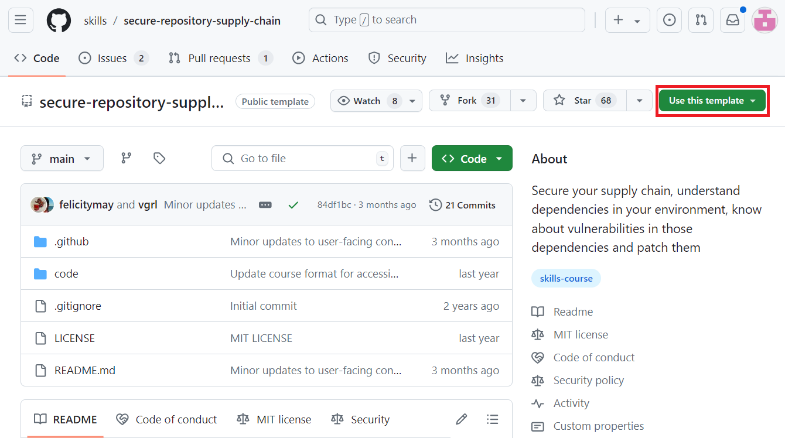
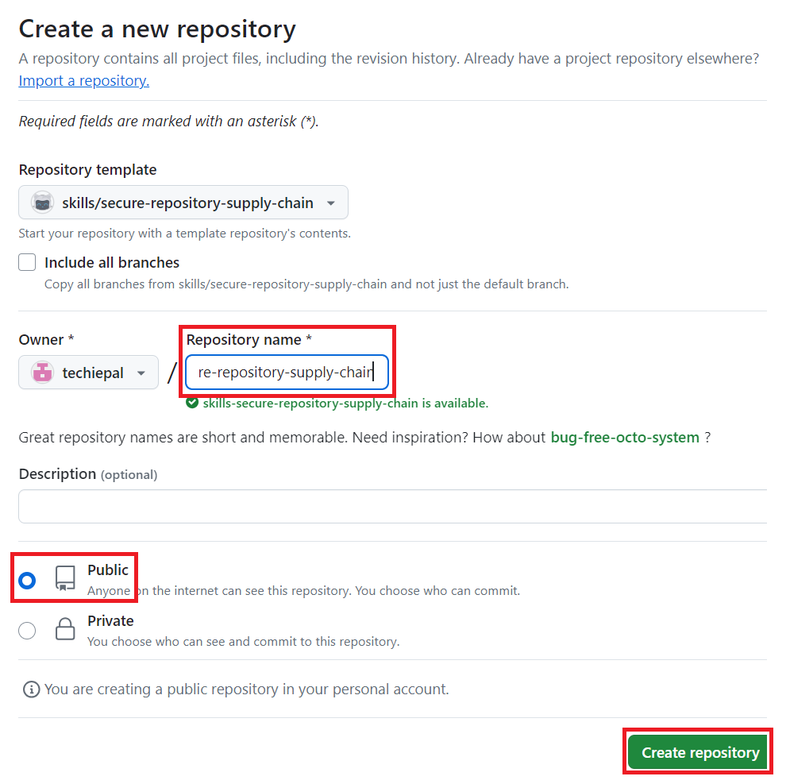
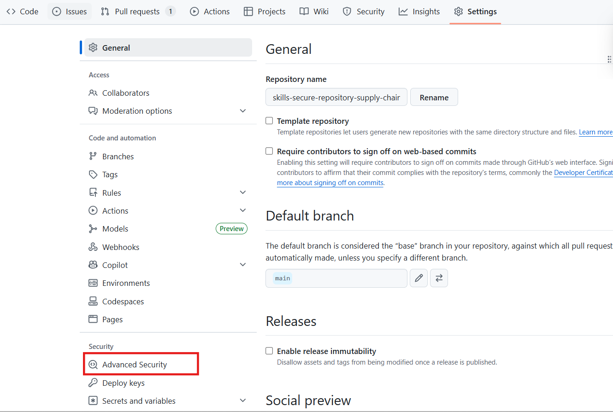
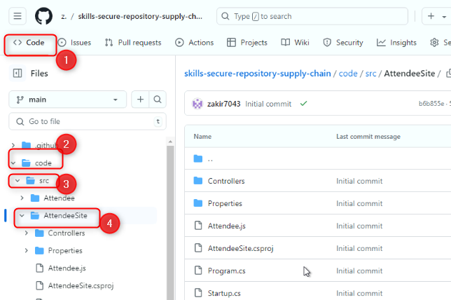
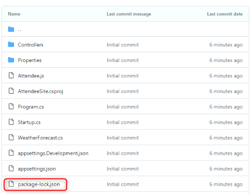
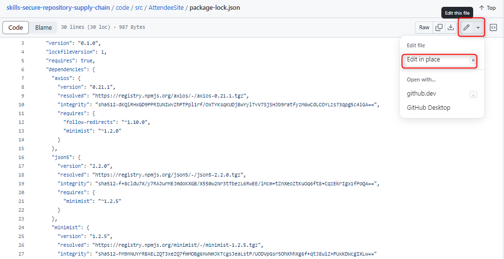
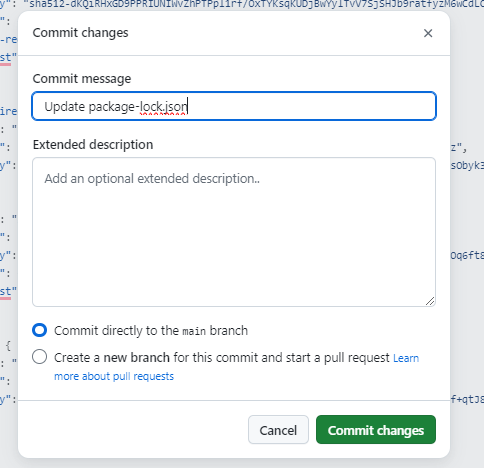
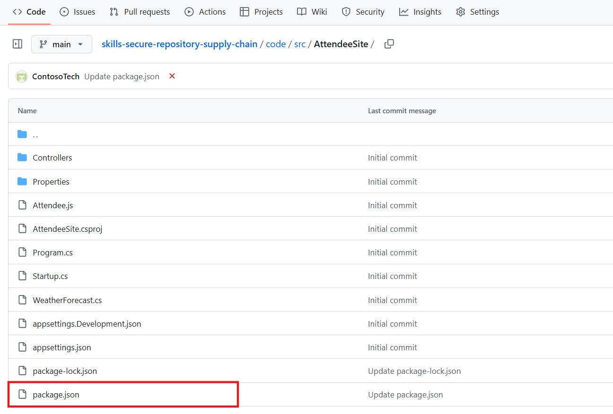
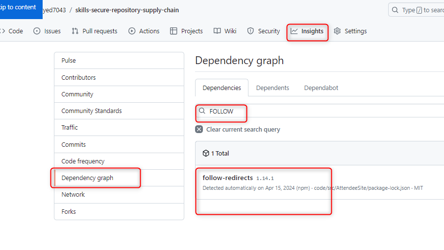
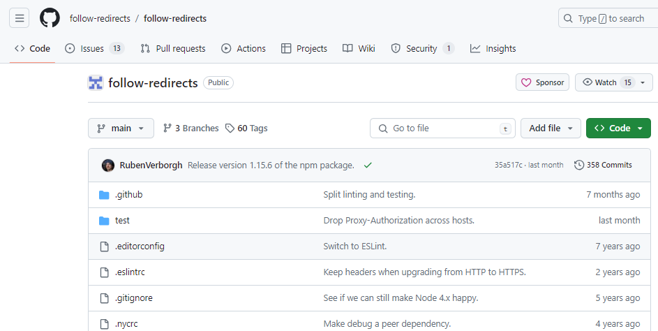

# Lab 01: Secure your repository's supply chain

**Objectives:**

Imagine you are responsible for maintaining the security of a software
project that relies on various third-party dependencies. To ensure the
integrity and safety of your project's supply chain, it's crucial to
understand and manage these dependencies effectively. This involves
identifying potential vulnerabilities within your dependencies and
applying necessary patches to secure your project. In this lab, you will
learn how to use GitHub's dependency graph feature to monitor and review
your dependencies, making sure your project remains secure and
up-to-date.

In this hands-on lab, you will:

- Enable Dependency Graph: Enable and verify the dependency graph
  feature in your repository settings to visualise your project's
  dependencies.

- Add a New Dependency: Add a new dependency to your project and ensure
  it is integrated properly.

- Review Dependency Graph: Use the dependency graph to review and
  confirm that the new dependency is correctly reflected and monitored.

# **Exercise 01: Create a new repository**

1.  Paste the URL and browse to the following repository: +++https://github.com/technofocus-pte/supplychain+++
    In this lab, you will create the repository using a public template **skills-secure-repository-supply-chain**

    

2.  Select **Create a new repository** under **Use this template** menu.

    

3.  Enter the following details and select **Create Repository**.

- Repository name: +++skills-secure-repository-supply-chain+++

- Repository type: **Public**

    

# **Exercise 02: Verify that dependency graph is enabled**

1.  On the landing page of the newly created repository navigate to the
    **Settings** tab.

    

2.  On the **Settings** page, select **Advanced Security** available
    under **Security.**

    

3.  Verify/enable Dependency graph. (If the repo is private, you will
    enable it here. If the repo is public, it will be enabled by
    default). **Note**: If Disbale button is visible, it means this is
    already enabled. Keep it as is.

    

# **Exercise 03: Add a new dependency and view your dependency graph**

1.  Navigate to the **Code** tab and locate the
    **code/src/AttendeeSite** folder.

    Note: You can either browse to the folder or use the **Go to file**
    search **code/src/AttendeeSite**

    

    

2.  Open the **package-lock.json** file

    

    

3.  Insert the following code snippet between line \# 14 and line \#15

    ```
    },
    "follow-redirects": {
    "version": "1.14.1",
    "resolved": "https://registry.npmjs.org/follow-redirects/-/follow-redirects-1.14.1.tgz",
    "integrity": "sha512-HWqDgT7ZEkqRzBvc2s64vSZ/hfOceEol3ac/7tKwzuvEyWx3/4UegXh5oBOIotkGsObyk3xznnSRVADBgWSQVg=="
    }
    ```

    

4.  Click **Commit changes** on the top right.

    

5.  After committing the changes in **package-lock.json**, navigate to
    the **AttendeeSite** folder.

    

6.  Now, open **package.json** file.

    

7.  Click on the **Edit** dropdown and select **In place** option.

    

8.  You need to add the dependency in **package.json** as well because
    only adding dependency in package-lock.json is not enough. GitHub’s
    dependency graph detects dependencies from manifest files, such as
    package.json.

    Add +++"follow-redirects": "1.14.1”+++ (copy with the quotation marks)
    dependency and make sure to add a comma (,) after the preceding
    (request-promise) dependency as shown in the image below.

    

    

9.  Once the dependency is added, **commit** the changes.

    

10. Again, click on Commit changes with the commit message.

    

11. On the main navigation bar click on the **Insights tab**.

    

12. On the left side navigation pane click on the **Dependency graph**.

    

13. Search for +++follow+++ to review the new dependency i.e.,
    follow-redirects on the Dependencies hub.

    

14. Open the follow-redirects dependency and review it.

    

### Summary:

    You have now gained valuable insights into managing your project's dependencies and securing your repository's supply chain, allowing you to proactively address and mitigate security risks.

