# Lab 8: Connect Azure AI Foundry to your Dev Workflow

**Introduction**

In this lab, you will learn how to connect Azure AI Foundry with your
development workflow by creating an Azure OpenAI resource, deploying a
model, and building an intelligent agent. You will also integrate the
agent with Azure Logic Apps to perform real-world actions and validate
the integration through testing and monitoring.

**Objectives**

By completing this lab, you will be able to:

- Create and configure an Azure OpenAI resource

- Set up an Azure AI Foundry project

- Deploy a base model and configure endpoints

- Create and test an AI agent using the Agents playground

- Integrate Azure Logic Apps as an action for the agent

- Authenticate connections and invoke actions securely

- Monitor and troubleshoot the underlying Logic App workflow

## **Exercise 1: Setting up the Environment**

### **Task 1: Create an Azure OpenAI resource**

1.  Browse to Azure Portal +++https://portal.azure.com/#home+++ and enter
    your email id.

2.  Enter your password to login.

3.  Once logged in, search for Azure OpenAI from the search bar at the
    top and select Azure OpenAI resource from the search results.

    

4.  Click on **+Create** button and from the dropdown, select **Azure OpenAI**.

    

5.  On the **Basics** tab, create a new resource group and name it as
    +++ai-test-rg+++ and click on **OK.**

    

6.  Enter the below details in the further fields and click on **Next**
    button.

    |Region	|Choose region as **East US**|
    |-------|-------|
    |Name |Enter +++ai-test-resource+++ as the Azure OpenAI name	|
    |Pricing tier |Select Standard S0	|

    

7.  Leave the default values in the **Network** tab and proceed by
    clicking on **Next**.

    

8.  Leave the default settings in the **Tags** tab and proceed by
    clicking on **Next**.

    

9.  When validated, review the Azure OpenAI resource and click on
    **Create**.

    

10. Deployment will be succeeded in 2-3 mins. Click on **Go to resource**.

    

11. From the **Overview** section, navigate to **Microsoft Foundry
    portal**.

    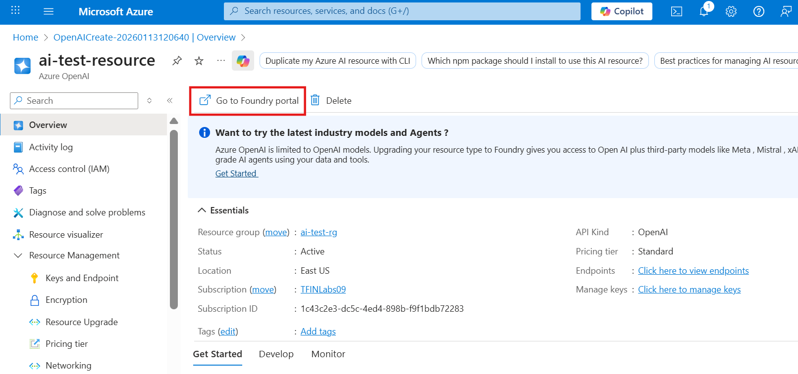

### **Task 2: Create an Azure Foundry Project**

12. Select the **OpenAI resource** dropdown at the top and select
    **+Create new.**

    

13. Select **Microsoft Foundry resource** and click on **Next**.

    

14. Enter the following details and click on **Create**:

    |Project	|Provide the project name as +++my-project+++|
    |-------|-------|
    |Microsoft Foundry resource |Enter the unique name as +++my-project-resource09+++	|
    |Resource group |Select **ai-test-rg** resource group that you have created earlier	|
    |Region |Choose **East US 2**	|

    

    

15. Select **Model + endpoints** from the **My assets** section in the
    left pane.

    

16. Select **+ Deploy model** and then, select **Deploy base model** to open the
    deployment window.

    

17. Search and select the **gpt-4.1** model and then select **Confirm**.

    

18. In the next window, configure the following fields and click on
    **Deploy**.

    |Deployment name	|Enter +++gpt-4.1+++ |
    |-------|-------|
    |Deployment type |Choose **Global Standard**	|
    |Deplopyment details |Keep the values as default	|

    

19. When the deployment completes, your model **Provisioning** state
    changes to **Succeeded**.

    

### **Task 3: Create an Agent in your project**

20. Navigate to **Agents** section from the left pane and select **New agent** button to create a new agent.
    
    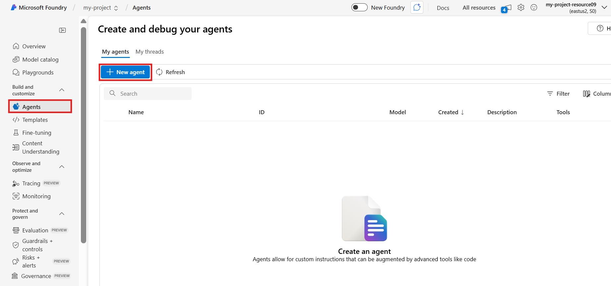

21. New agent has been created successfully. Click on **Try in playground** from the **setup** window.

    

22. You will land directly in the agent playground, and you can start
    creating agents. You can give your agent instructions on what to do
    and how to do it. 
    
    **For example**: +++You are a helpful agent that can answer questions about geography.+++ 
    
    Then you can start chatting with your agent.

    

## **Exercise 2: Add an action to your agent**

Follow these steps to set up an action for your agent to create and run
a logic app workflow.

23. Navigate to **Agents** from the left pane.

    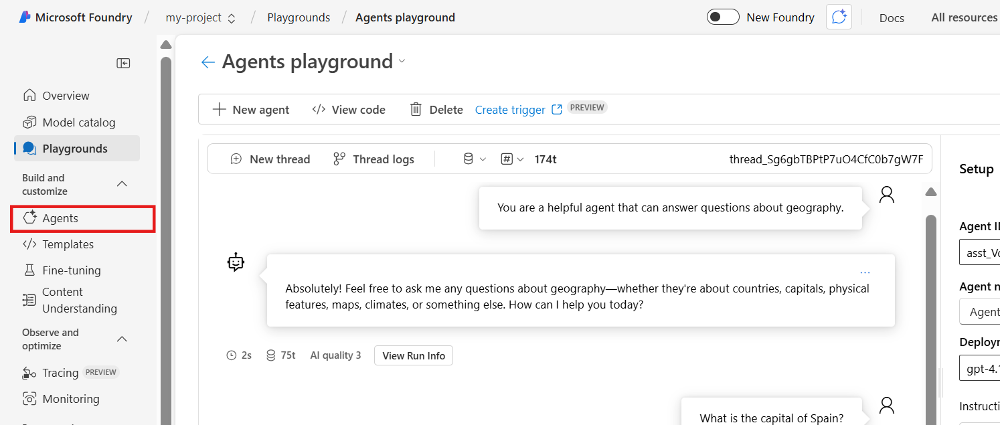

24. Select your agent and then, in the **Setup** section next to the
    agents list, scroll down to the **Actions** section, and
    select **Add**.

    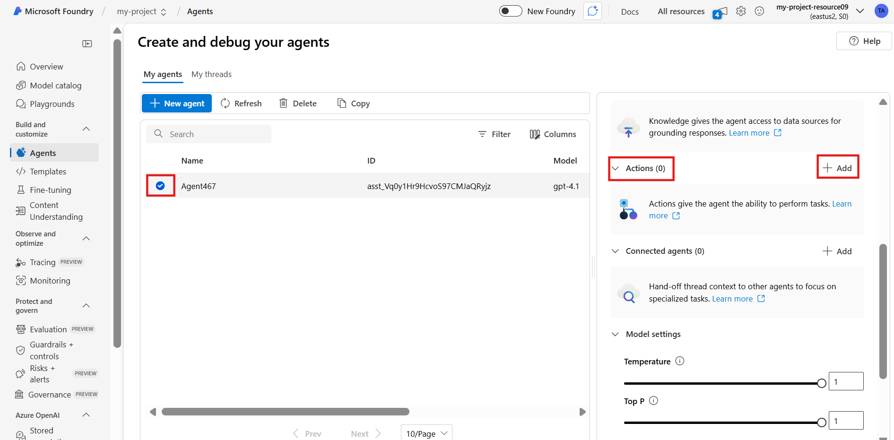

25. In the **Add action** window, select **Azure Logic Apps**.

    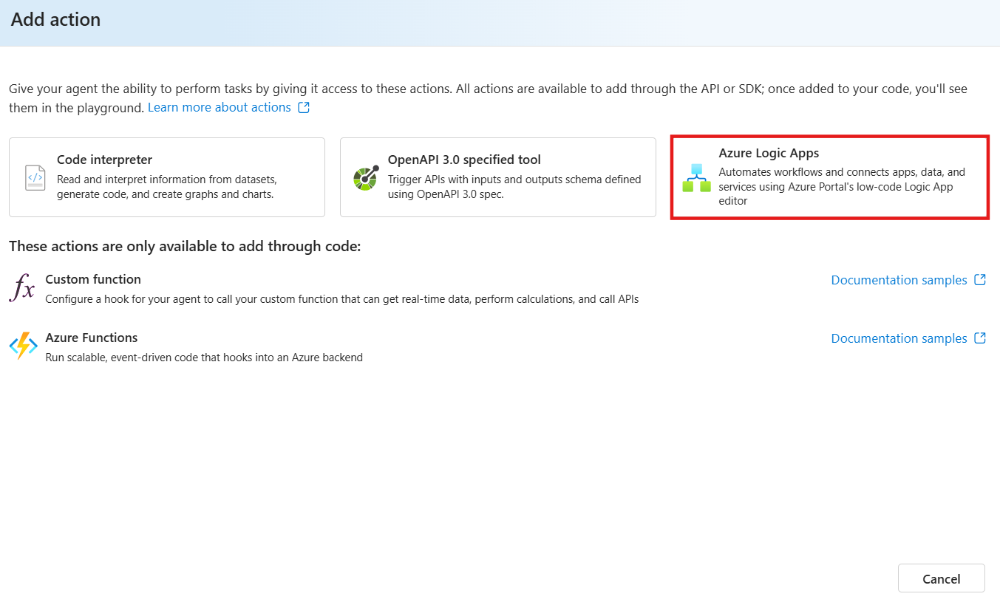

26. Under select an action, select Microsoft authored action named **Get
    Weather forecast for today via MSN Weather**.

    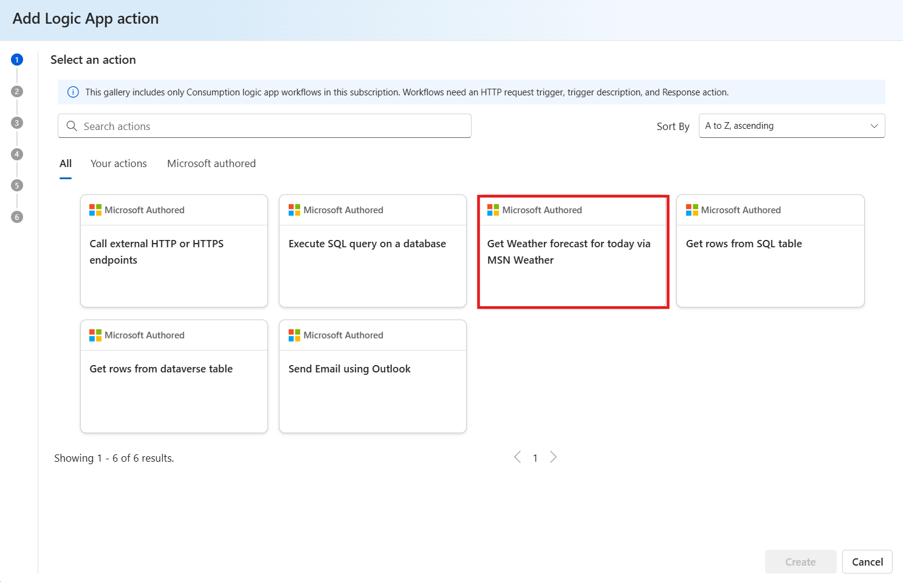

27. In the **Add Logic App action** window, under the **Enter some basic
    information**, provide the following information:

    |Your action name	|Enter the name as +++Get-weather-forecast+++|
    |-------|-------|
    |Action description |Enter +++This action creates a callable Consumption logic app workflow that gets the weather forecast for today and runs in global, multitenant Azure Logic Apps.+++	|
    |Subscription |Select your subscription	|
    |Resource group |Select **ai-test-rg** (you have created this initially)	|
    |Location |Select **East US 2**	|

    

## **Exercise 3: Create and authenticate connections**

Follow these steps to create any connections that the action needs and
authenticate access to the relevant services, systems, apps, or data
sources. The underlying template specifies the connectors to use for
this action and the logic app workflow.

28. In the Add Logic App action window, under Authenticate, review any
    connections that you need to create and authenticate.

29. In the **Connection** column, select **Connect** for the related
    service or data source.

    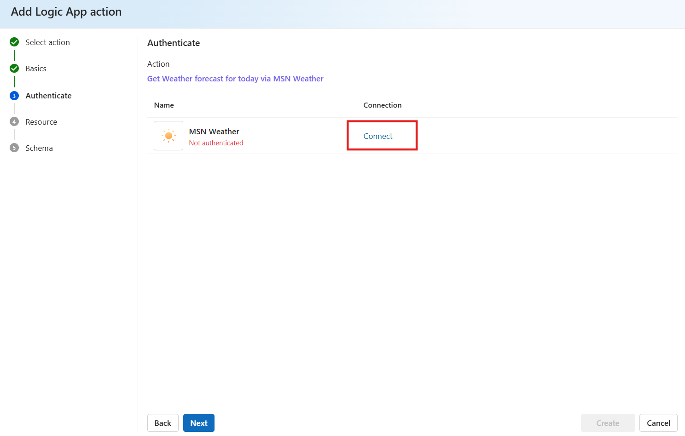

30. Authentication is completed. Click on **Next**.

    

## **Exercise 4: Confirm action details**

31. In the **Add Logic App action** window, under **Resource**, check
    all the provided action information.

32. For a selected Microsoft authored action, complete the following
    steps:

    Review the statement that you acknowledge and understand the following
    events that happen after you leave **Resource** page by
    electing **Next**:

    - You can't return to the previous steps.

    - The action creates a Consumption logic app resource.

    - Connecting to Azure Logic Apps incurs charges in your Azure account.

33. To consent, select the confirmation box and click on **Next**.

    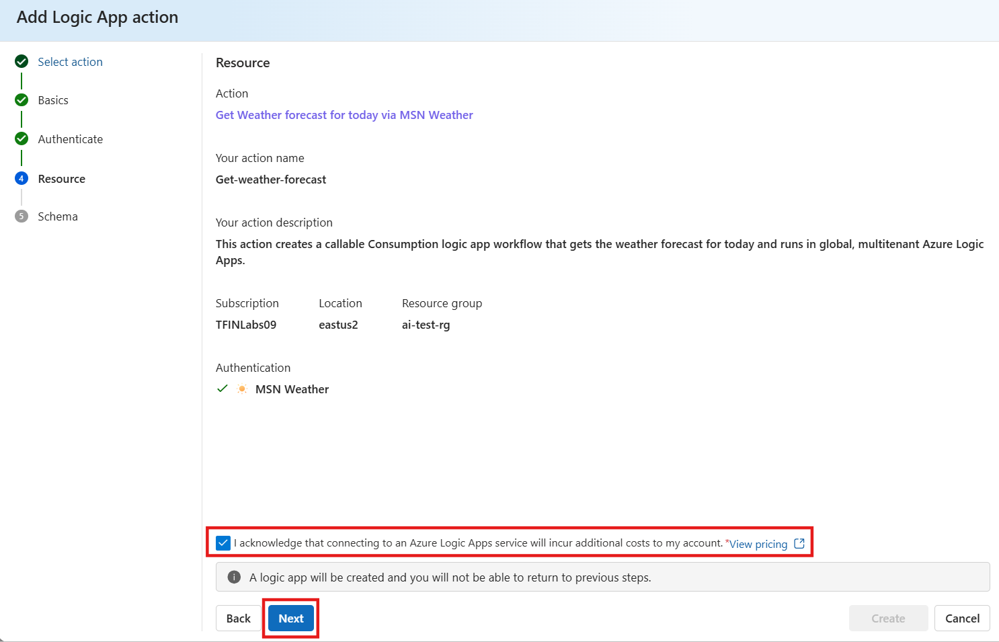

## **Exercise 5: Finish creating the action**

For the final step, review the information that the portal generates
about the tool used by the agent to run your action and authenticate
access to any relevant Azure, Microsoft, and non-Microsoft services or
resources.

34. In the **Add Logic App action** window, on the **Schema** page,
    review the following information, and make sure to provide a
    description about the circumstances for calling the tool:

    |Tool name	|You can keep the tool name as it is |
    |-------|-------|
    |Connection for authentication |The read-only name for the connection that the agent uses to access Azure, Microsoft, and external resources without having to ask for credentials every time.	|
    |Describe how to invoke the tool |Enter +++Invoke this tool when the agent gets the request or prompt to get the weather forecast for today.+++	|
    |Schema |The schema for the logic app workflow in JavaScript Object Notation (JSON) format.	|

    When you’re done, click on **Create**.

    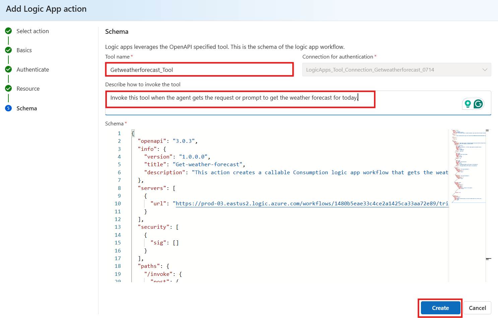

35. The portal returns you to the **Agents** page for your selected
    agent. In the **Setup** section, the **Actions** section now shows
    the name for the tool that runs your action and displays the icon
    for Azure Logic Apps next to the tool name.

    

## **Exercise 6: Test the agent action**

To try the new action for your agent by using the **Agents playground**,
follow these steps:

36. On the **Agents** page, at the top of the **Setup** section,
    select **Try in playground**.

    

37. On the **Agents playground** page, in the user query chat box, ask a
    question about the weather, for example:

    **What is the weather in London? Show the results in bullet list
    format.**

    The agent returns a response similar to the following:

    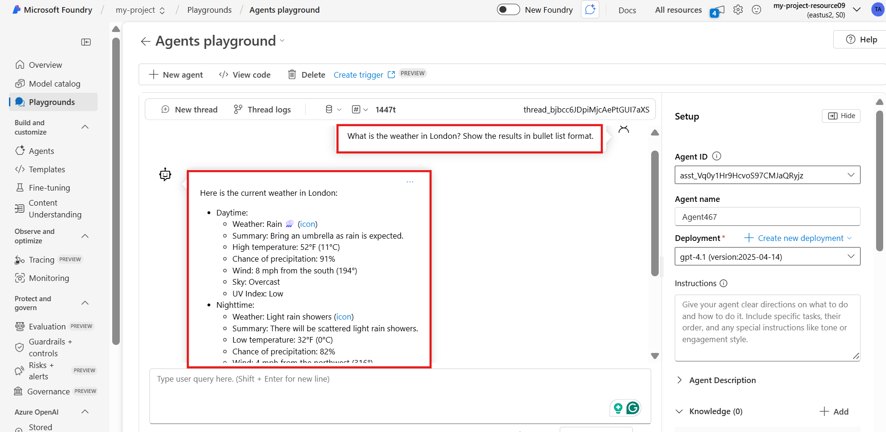

## **Exercise 7: Review underlying logic app and workflow**

After the action runs, you can view the underlying logic app resource
and workflow in the Azure portal. You can review the workflow's run
history, which you can use to debug or troubleshoot problems that the
workflow might experience.

38. Navigate to **Azure portal** and search for the action
    (**Get-weather-forecast**) you created.

    In the results list, under **Resources**, select the logic app
    resource.

    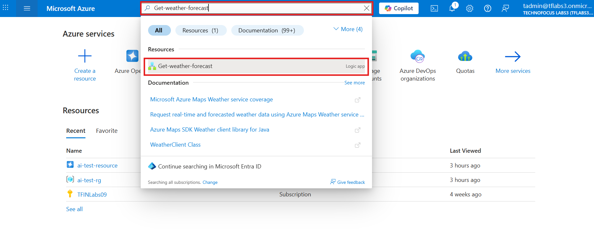

39. To view the workflow's run history, inputs, outputs, and other
    information, on the logic app menu, under **Development Tools**,
    select **Run history.**

    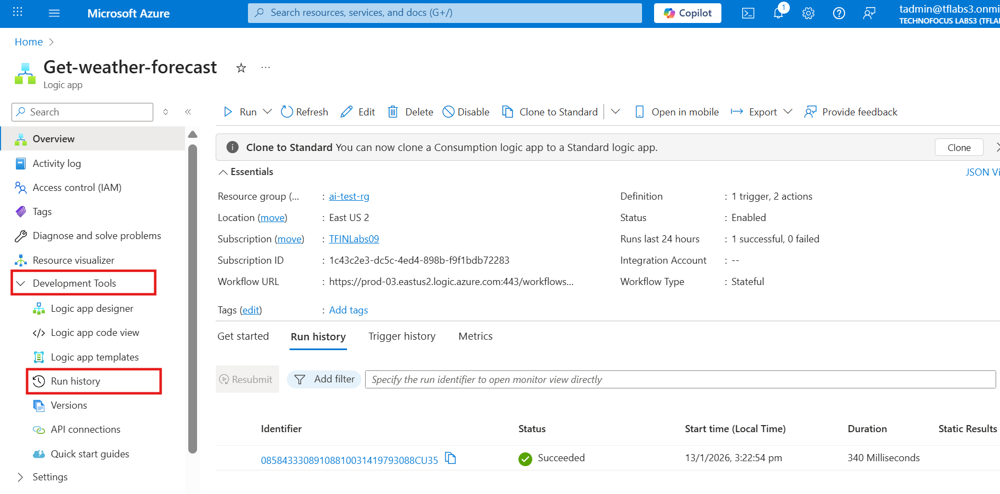

40. In the **Run history** list, select the latest workflow run.

    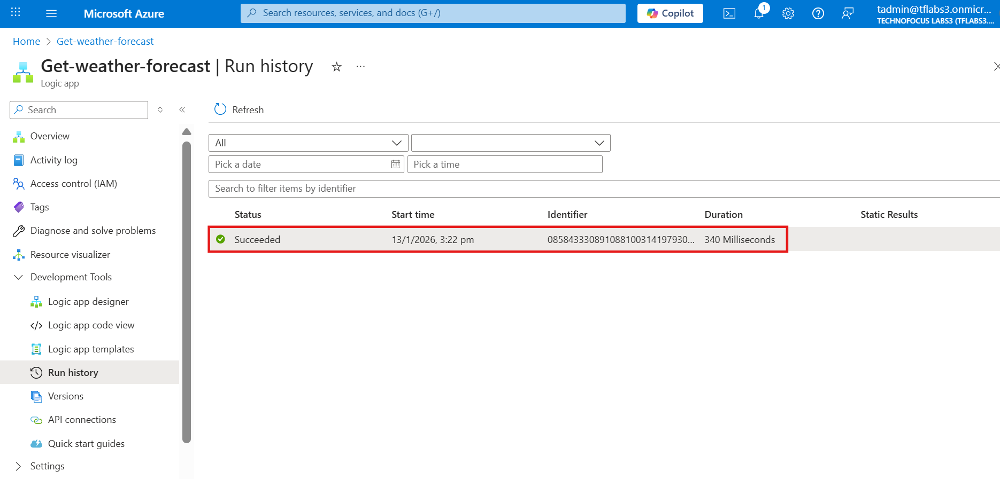

41. After the monitoring view opens and shows the status for each
    operation in the workflow, select an operation to open the
    information pane and review the operation's inputs and outputs.

    This example selects the action named **Get forecast for today.**

    

    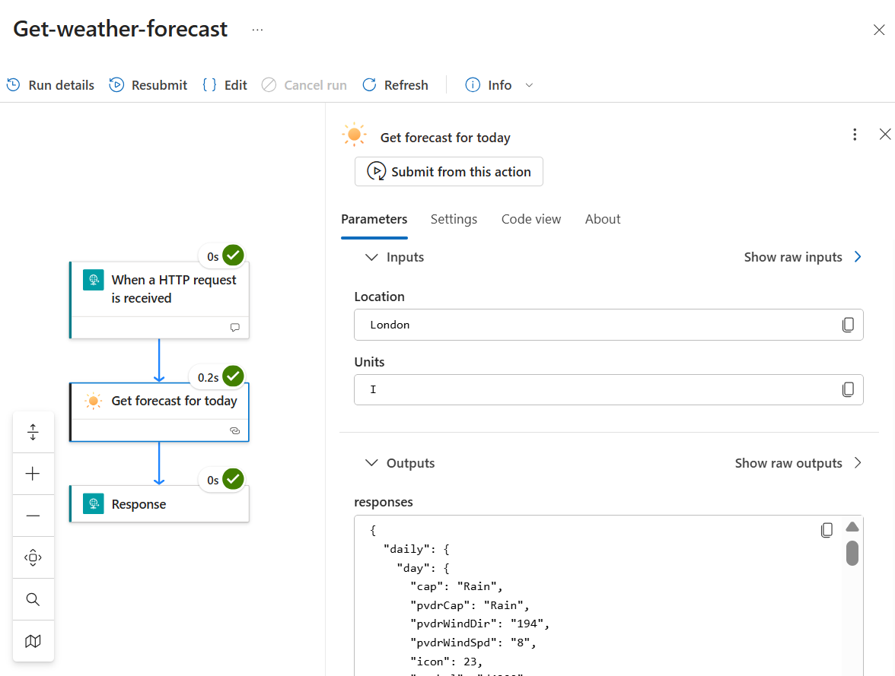

## **Exercise 8: Open and Test a workflow in the designer**

Follow these steps to review the workflow definition and operations or
edit the workflow by opening the workflow designer.

42. On the logic app menu, under **Development Tools**, select the
    **Logic app designer**.

    The workflow opens in the designer. You can now review the workflow's
    operations, which refer to the trigger and actions.

    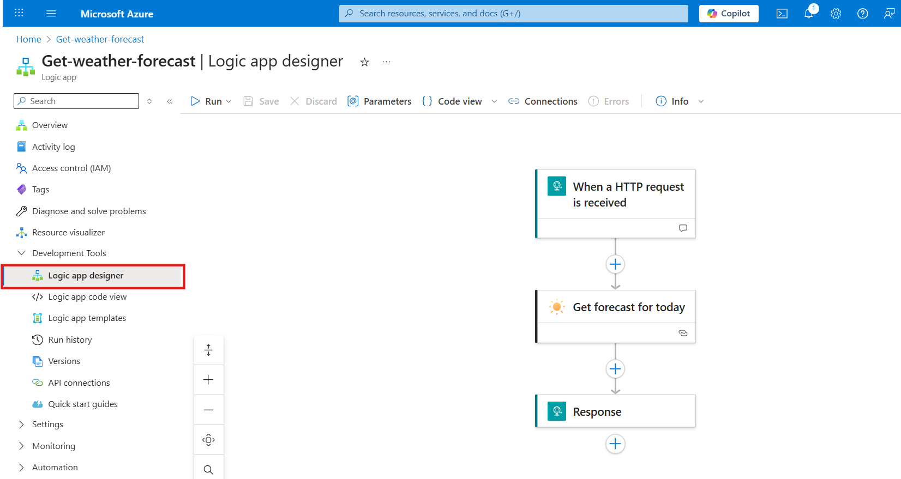

43. To view an operation's parameters and settings, on the designer,
    select the **Get forecast for today** operation.

    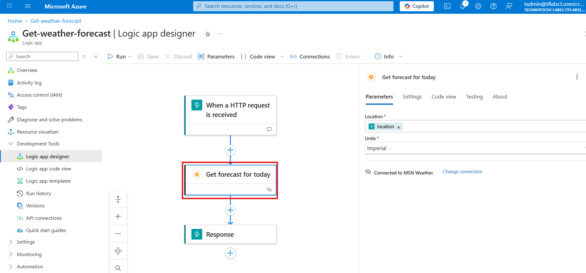

44. On the designer toolbar, select **Run \> Run with payload**.

    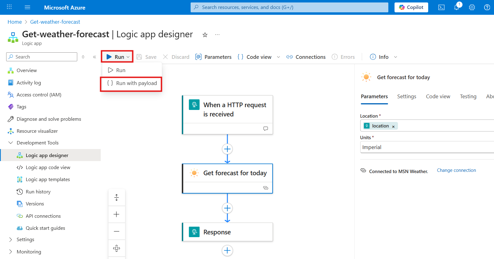

45. After the **Run with payload** pane opens, in the **Body** field,
    provide the expected trigger inputs in JSON format:

    ```
    {
    "location": {
        "type": "London",
        "description": "Location for the weather"
        }
    }
    ```

    

46. When you’re ready, select **Run**.

    

47. On the **Output** tab, the Response Body contains the results and
    response from the workflow.

    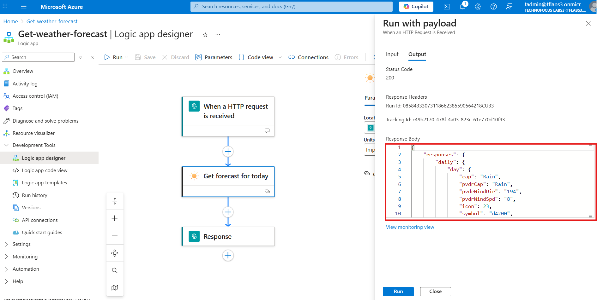

    

## **Conclusion**

In this lab, you successfully connected Azure AI Foundry to your
development workflow by deploying a model, creating an agent, and
extending its capabilities using Azure Logic Apps. This integration
demonstrates how AI agents can interact with external services, enabling
scalable and actionable AI-driven solutions.

