# Lab 05: Code with Codespaces and Visual Studio Code

In this lab, you’ll explore how GitHub Codespaces and Visual Studio Code
work together to provide a cloud-based development environment. You’ll
create and manage a Codespace, make code changes directly in VS Code,
and learn how to customize and personalize your development setup to
improve productivity and consistency.

### **Objective:**

- Create and launch a GitHub Codespace from a repository

- Use Visual Studio Code within a Codespace to edit and manage code

- Commit and push code changes from a Codespace to GitHub

- Configure a custom development container using devcontainer.json

- Customise a Codespace with extensions and startup settings

- Execute commands automatically when a Codespace is created

- Personalise the development environment using dotfiles

## **Task 1: Start a Codespace**

1. Sign in to GitHub with your GitHub account.

2. Browse to the following repository- +++https://github.com/skills/code-with-codespaces.git+++

    

3. Navigate to **Code** menu and create a **new Codespace** on the main branch.

    

4.  Wait about 2 minutes for the Codespace to spin itself up. It's a
    virtual machine spinning up in the background.

    

5.  Once the Codespace is ready, select the **src** folder from the
    explorer in the left pane.

  

6.  Create a **new file** under the src folder.

    

## **Task 2: Push code to your repository from the Codespace**

1. Enter the file name as +++index.html+++

  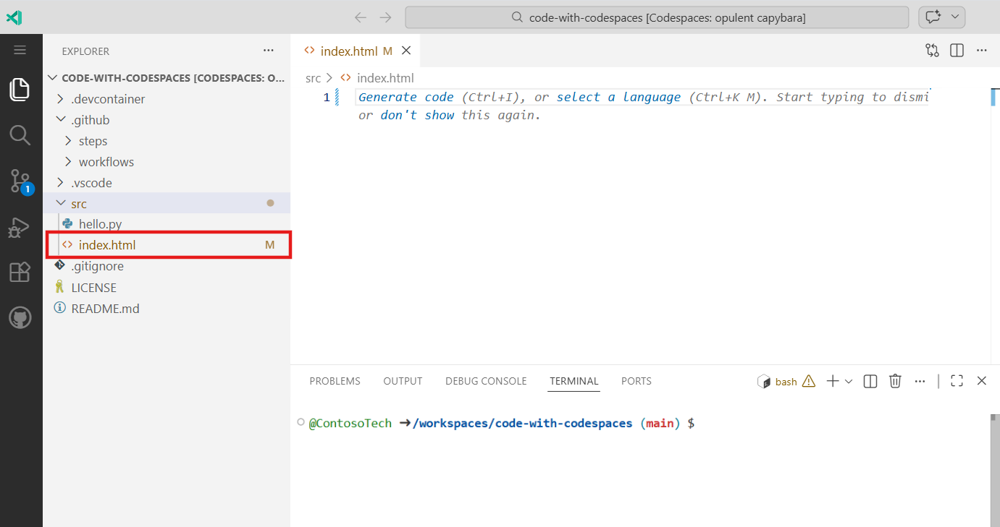

2. Select the **index.html** file. Enter the code below:

  ```
  <html>
  <h1> Hello from the codespace!</h1>
  </html>
  ```

**Note**: The file should autosave.

    

3.  Once the code is added, navigate to **Source control** tab from the
    left pane.

  

4. Enter commit message as +++updated index.html+++ and commit the changes.

    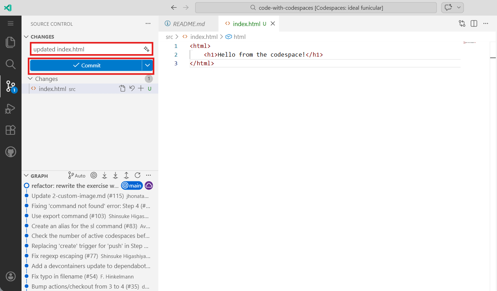

5.  Select **Yes** to stage all your changes and commit them directly.

  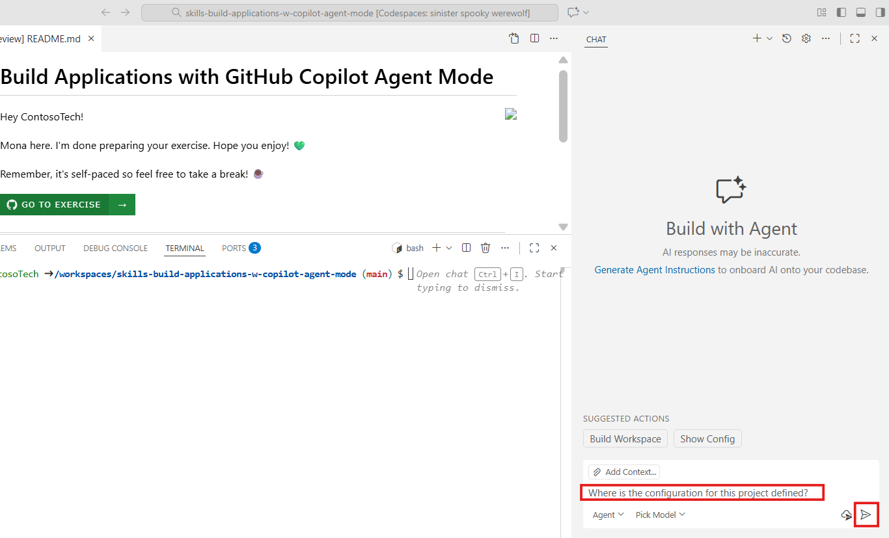

6.  Sync the changes.

  

7.  Click on **OK** to confirm.

  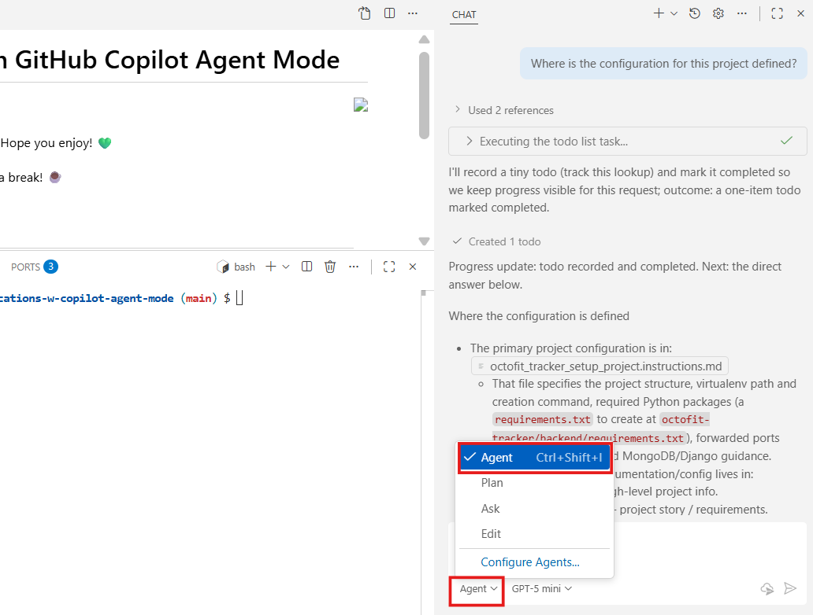

8.  Navigate to **GitHub repository** and select **src** folder.

  

9.  View the **index.html** to verify that the new code was pushed to
    your repository.

  

10. You can see the code is now successfully pushed to the repository.

  

11. Select the **repository name** to switch back to the main page.

  

## **Task 3: Add a custom image to your Codespace**

*You created your first codespace and pushed code using VS Code!*

You can configure the development container for a repository so that any
codespace created for that repository will give you a tailored
development environment, complete with all the tools and runtimes you
need to work on a specific project.

**What are development containers?** Development containers, or dev
containers, are Docker containers that are specifically configured to
provide a fully featured development environment. Whenever you work in a
codespace, you are using a dev container on a virtual machine.

A dev container file is a JSON file that lets you customise the default
image that runs your codespace, VS Code settings, run custom code,
forward ports and much more!

Let's add a devcontainer.json file and add a custom image.

1.  On the repository’s homepage, click on **Add file** dropdown.

  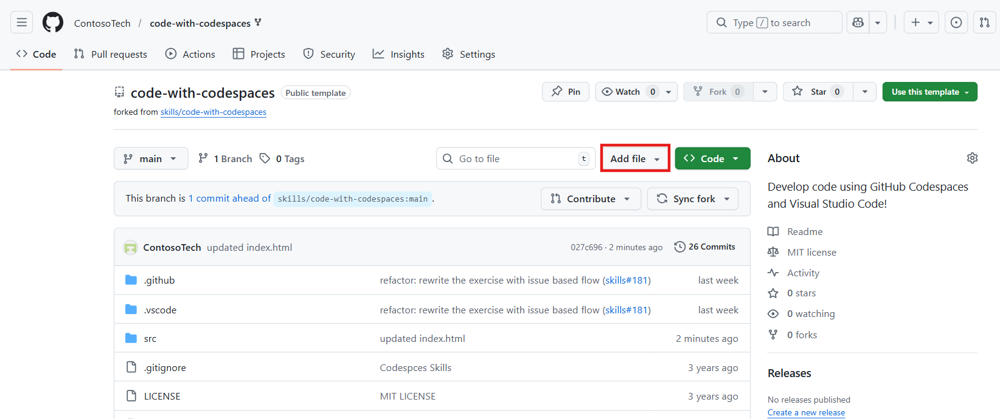

2.  Select the **Create new file** option from the dropdown menu.

  

3.  Enter the folder name as **.devcontainer** followed by a slash **/**
    to enter the file name in the next step. Hence, you need to enter
    the folder name as:

    +++.devcontainer/+++
 
    
    
    

4.  Now, enter +++devcontainer.json+++ as the file name.

    

5.  In the body of the new **.devcontainer/devcontainer.json** file, add
    the following content. Click **Commit changes**.

    ```
    {
    // Name this configuration
    "name": "Codespace for Skills!",
    // Use the base codespace image
    "image": "mcr.microsoft.com/vscode/devcontainers/universal:latest",
    "remoteUser": "codespace",
    "overrideCommand": false
    }
    ```
 
  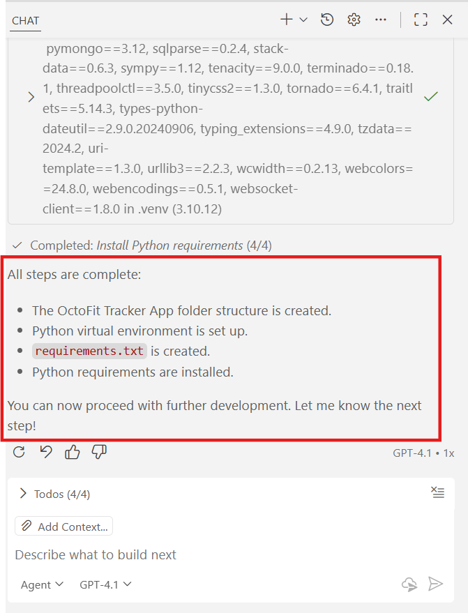

6.  Copilot has already generated the **commit message**. Then, select
    **commit changes** button.

  

## **Task 4: Customise your Codespace- Add customisations to the devcontainer file**

You created a codespace with a custom image!

You can customise your codespace by adding VS Code extensions, adding
features, setting host requirements, and much more.

Let's customise some settings in the devcontainer.json file!

1.  Navigate to the **.devcontainer/devcontainer.json** file. Click on
    **Edit.**

  

2.  Add the following customisations to the body of the file **before
    the** **last curly bracket }**. Click **Commit changes** 

    ```
    // Add the IDs of extensions you want installed when the container is created.
    "customisations": {
        "vscode": {
            "extensions": [
                "GitHub.copilot"
            ]
        },
        "codespaces": {
            "openFiles": [
                "codespace.md"
            ]
        }
    }
    ```
  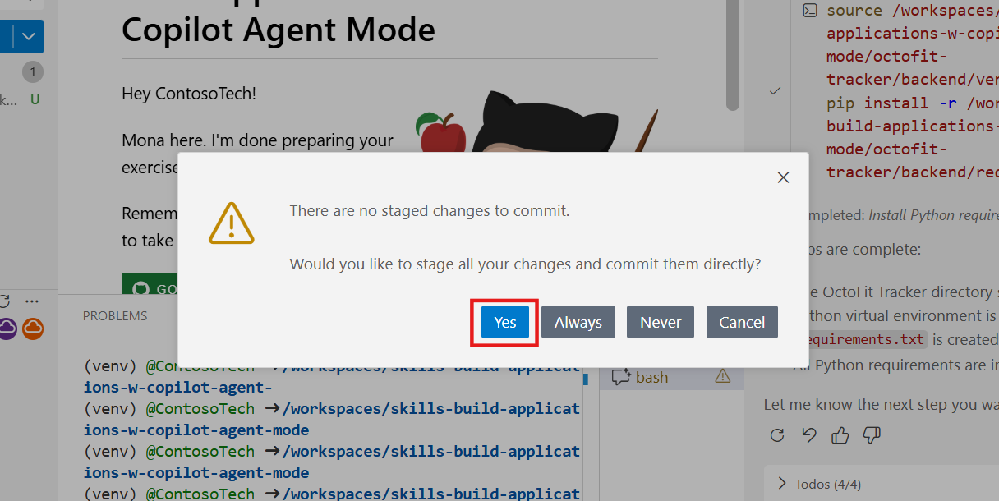

3.  Select **Commit changes directly to the main branch**.

  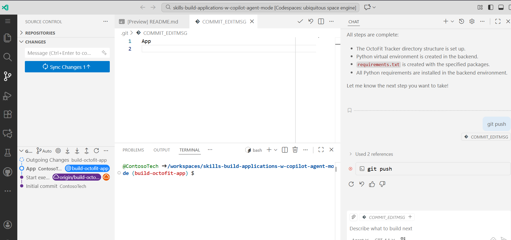

4.  Click on the **repository name** to switch back to the main page.

  

5.  Expand the **Code** section.

  

6.  Create a **New Codespace** by clicking **+** icon.

  

7.  Wait about **2 minutes** for the codespace to spin itself up.

  

8.  Once the codespace is ready, navigate to the **Extensions** tab.

  

9.  Search for **GitHub Copilot** in the extensions search bar and make sure this extension is installed.

  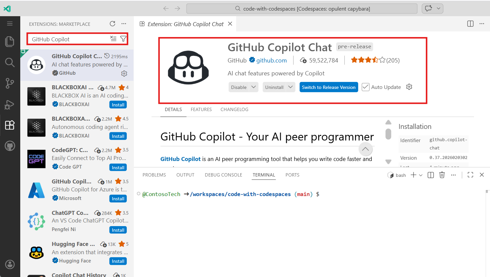

Next, let’s add some code to run upon creation of the codespace!

## **Task 5: Execute code upon creation of the codespace**

1.  Navigate to the GitHub repository and **edit**
    the **devcontainer.json** file.

  

2.  Add the following **postCreateCommand** to the body of the file
    **before the last curly bracket }.** After that, **commit** the
    changes.

    ```
    ,
    "postCreateCommand": "echo '# Writing code upon codespace creation!'
    \ \  codespace.md"
    ```

    

3.  With the commit message, click on **commit changes**.

    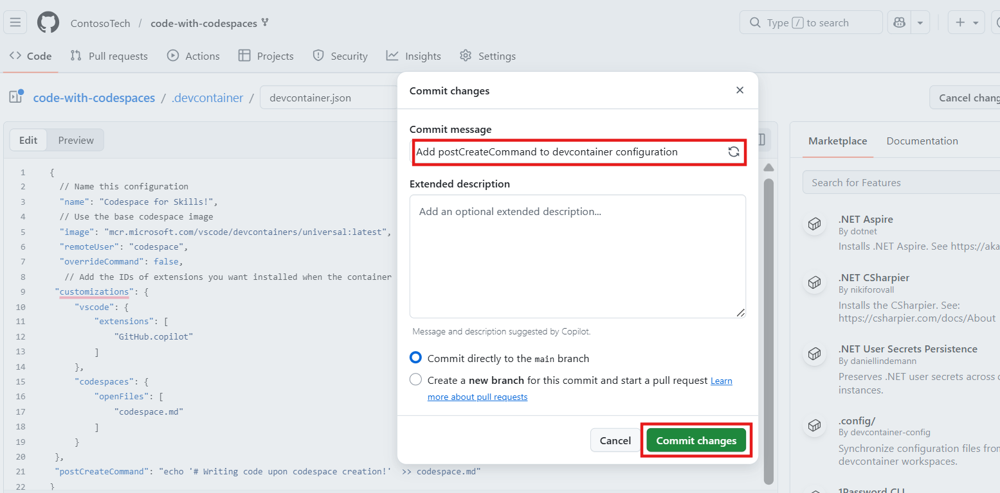

## Task 6: Personalise your codespace- Enable a dotfile for your codespace

When using any development environment, customising the settings and
tools to your preferences and workflows is an important step. GitHub
Codespaces offers two main ways of personalising your
codespace: Settings Sync with VS Code and dotfiles.

Dotfiles will be the focus of this activity.

**What are dotfiles?** Dotfiles are files and folders on Unix-like systems
starting with . that control the configuration of applications
and shells on your system. You can store and manage your dotfiles in a
repository on GitHub.

Let's see how this works!

1.  Start from the landing page of your repository. In the upper-right
    corner of any page, click your profile icon, and then
    click **Settings**.

  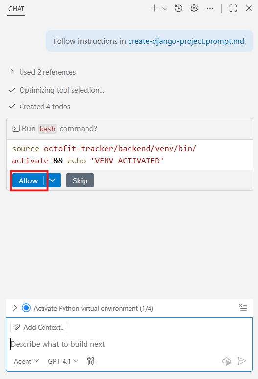

2.  In the **Code, planning, and automation** section of the sidebar,
    click **Codespaces**.

  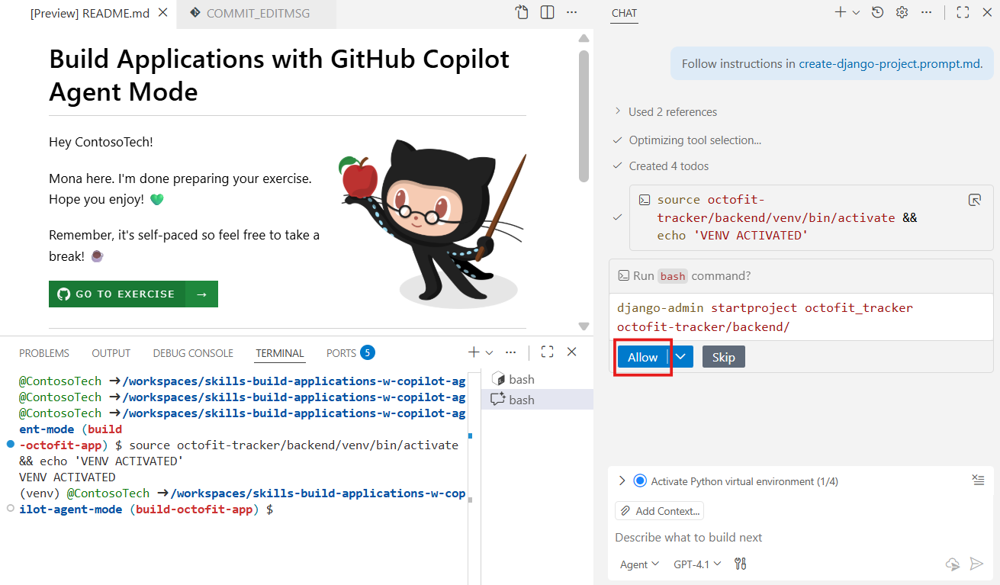

3.  Under **Dotfiles**, select **Automatically install dotfiles** so
    GitHub Codespaces automatically installs your dotfiles into
    every new codespace you create.

  

4.  Click **Select repository** and then choose your current skills
    working repository as the repository from which to install dotfiles.

  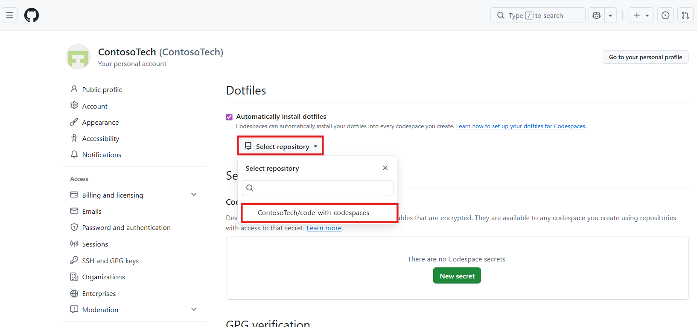

## **Task 7: Add a dotfile to your repository and run your codespace**

1.  Once the repository is selected, click on the **hamburger** icon to
    navigate to the main page of the repository.

  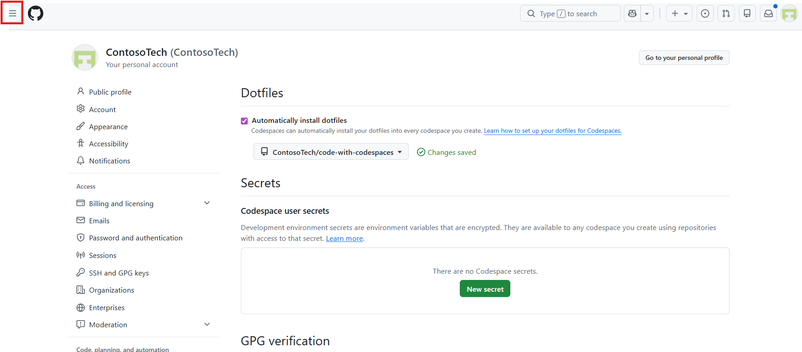

2.  Select your repository.

  

3.  Select Code and under the codespaces, delete the codespace that you
    have created initially in this lab.

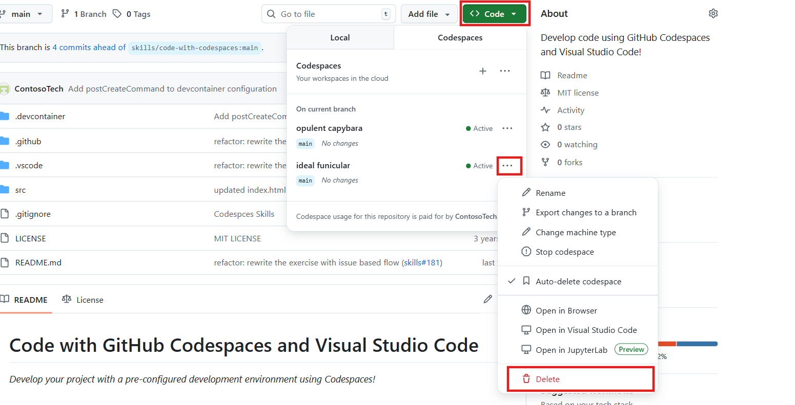

4.  Once one codespace is deleted, start a **new codespace** because
    maximum of two codespaces are allowed to be created.

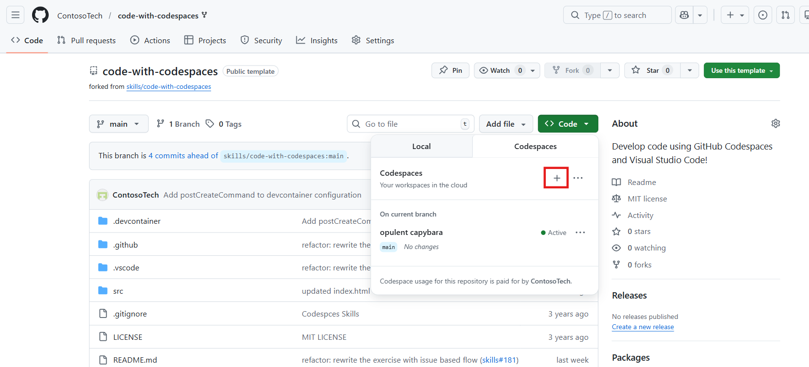

5.  From inside the codespace in the VS Code explorer window, create a
    new file.

  

6.  Provide a name to the new file as +++setup.sh+++

  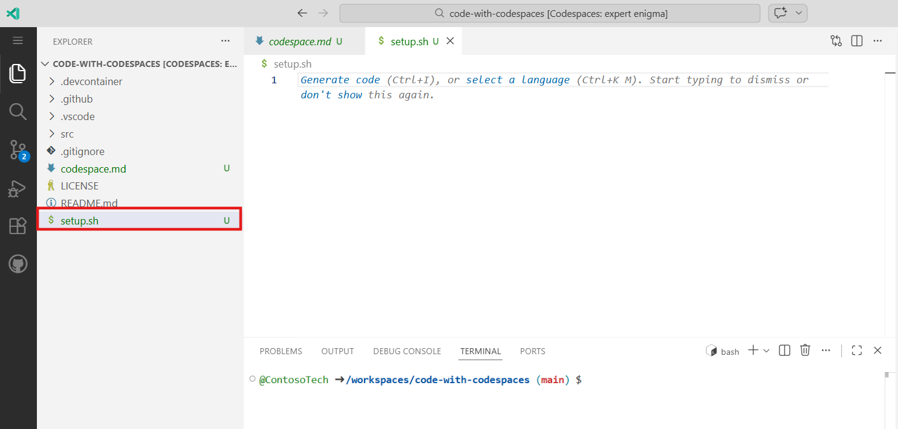

7.  Enter the following code into the file:

    ```
    #!/bin/bash
    sudo apt-get update
    sudo apt-get install sl
    echo "export PATH=\$PATH:/usr/games" >> ~/.bashrc
    ```

    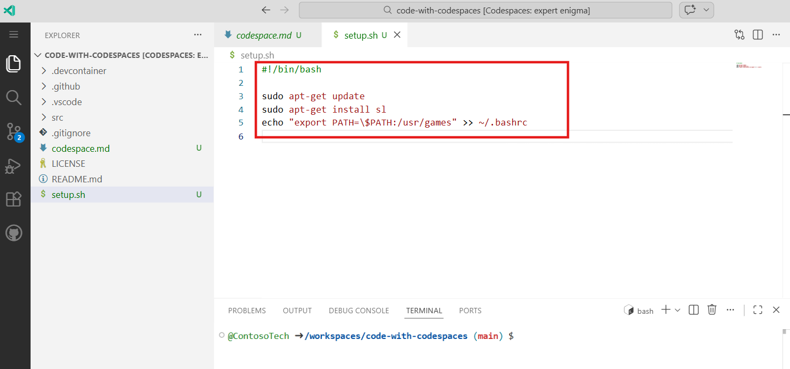

    **Note**: The file should autosave.

8.  From the **VS Code terminal**, enter the command below and press
    **Enter**:

    ```
    git add setup.sh --chmod=+x
    ```

  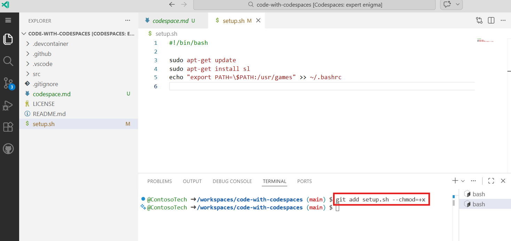

9.  Now, enter the commit message through this command:

    ```
    git commit -m "Adding setup.sh from the codespace!"
    ```

  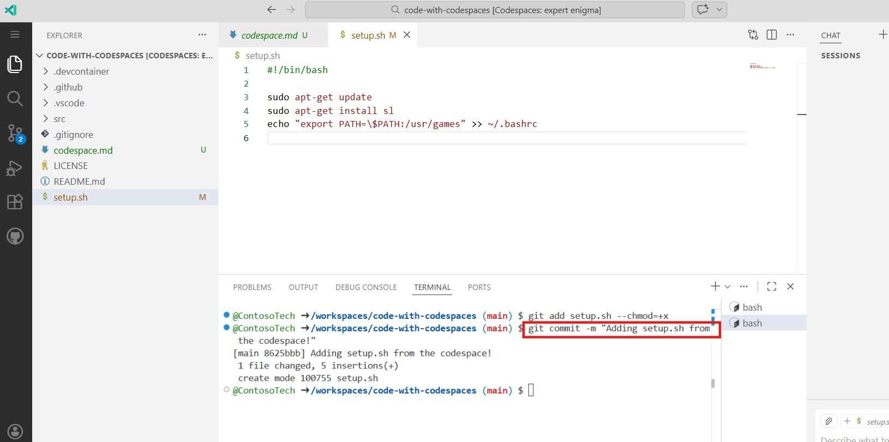

10. Navigate to **Source Control.**

  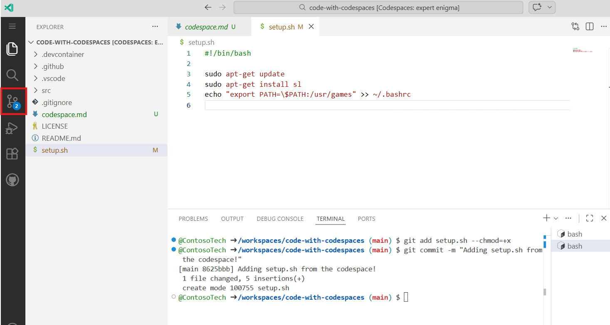

11. Update the commit message and commit the changes.

  

12. Click on **Yes** to stage all changes and commit them directly.

  

## **Summary:**

**Congratulations, you've completed this lab and learned a lot about
GitHub Codespaces!**

In this lab, you learned how to use GitHub Codespaces as a fully
featured cloud development environment with Visual Studio Code. You
practiced creating and managing codespaces, pushing code changes,
customizing the development container, and personalizing your setup
using extensions and dotfiles. These skills help you create consistent,
efficient, and reproducible development environments for yourself and
your team
