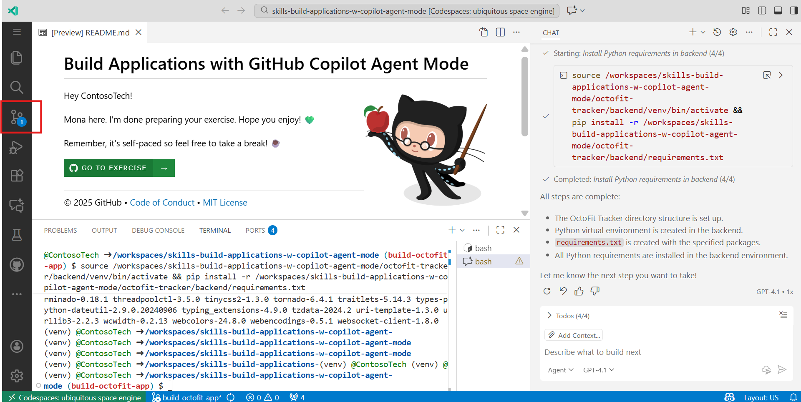
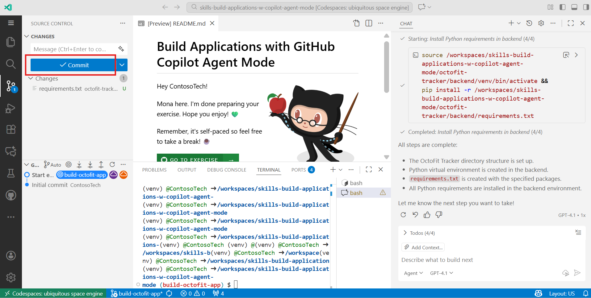
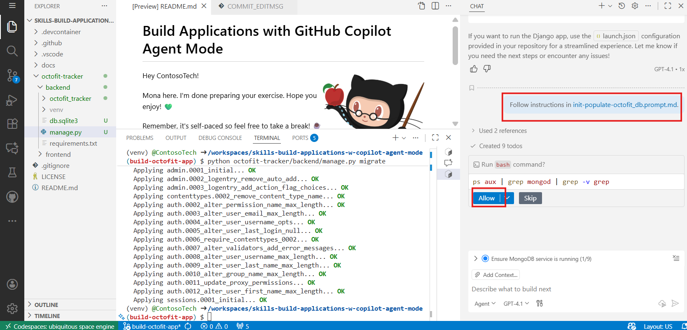
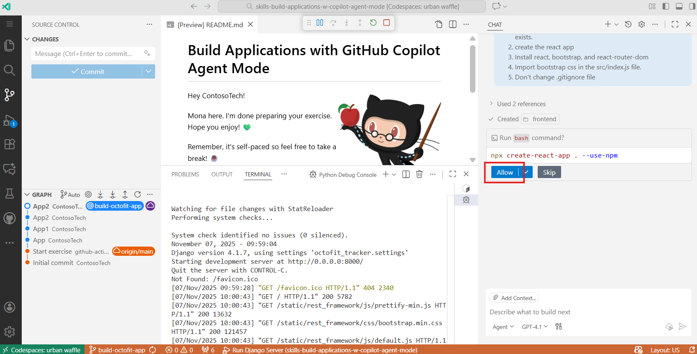
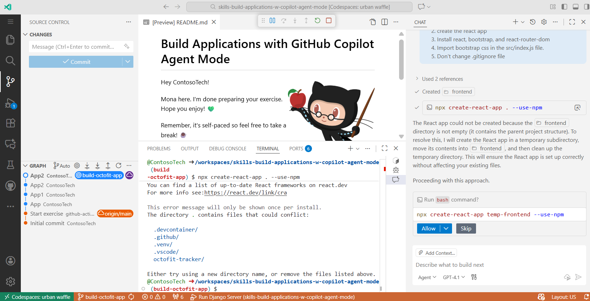

# Lab 05: Build Application using the GitHub Copilot

In this lab, participants will set up a preconfigured development
environment using GitHub Codespaces to build a full-stack OctoFit
Tracker application. They will use GitHub Copilot in agent mode to
create and publish branches, set up the backend with Django and MongoDB,
and configure the frontend using React. By the end of the lab,
participants will have an integrated, functional web application
connected to a MongoDB database, accessible and tested directly from
their GitHub Codespace environment.

**Objectives:**

- Set up the development environment using GitHub Codespaces.

- Create and publish a branch with Copilot agent mode.

- Configure app structure with frontend and backend folders.

- Set up MongoDB and integrate it with Django.

- Build and test REST APIs.

- Develop and connect the React frontend.

- Apply Bootstrap styling to the app.

## **Exercise 1: Set Up the Environment**

1.  Sign in to your GitHub account.

2.  Browse to the following link:
    +++https://github.com/skills/build-applications-w-copilot-agent-mode/tree/main+++

    In this lab you will create the repository using a public template **skills-build-applications-w-copilot-agent-mode**.

    

3.  Select **Create a new repository** under **Use this template** menu.
    This Duplicates the lab setup under your account to make changes
    safely.

    

4.  Enter the following details and select **Create Repository**.

- Repository name: +++skills-build-applications-w-copilot-agent-mode+++

- Repository type: **Public**

    

5.  Click the green-coloured **Code** button to proceed with creating
    workspace in the cloud.

    In the drop-down pane select **Codespaces** tab. This Launches a
    cloud-based development environment with preinstalled tools.

    

6.  Click **Create codespace on main** button.

    

7.  Wait for some time (approximately 5 mins) for Visual Studio Code to
    load and complete creating the codespace.

    

    

## **Exercise 2: Application Initial Setup**

Now that we are familiar with the app and we know it works, let's ask
copilot for help starting a branch so we can do some customizing.

1.  Select **GitHub Copilot Chat** from the top of the vs code. This
    enables Copilot’s AI-driven coding assistance.

    

2.  Click on **Show config** option from the copilot chat and send the
    prompt.

    

    

    

3.  Make sure ‘**Agent’** mode is selected to enable Copilot's agent
    mode. This activates automation to perform multi-step actions (like
    creating branches and installing dependencies).

    

4.  Let's ask Copilot agent mode to help us remember the command and
    create the branch build-octofit-app and publishing it. The creation
    of new branch separates changes from the main branch for safer
    collaboration.

    +++Please create and publish a new Git branch called build-octofit-app+++

    Click on **Allow** button to execute the command.

    

    

5.  Navigate to the repository and click on **main** **dropdown** where
    you’ll see the new branch listed as **build-octofit-app**. Open that
    branch.

    

    

6.  Open up a **new Copilot Chat** session by hitting the
    plus **+ **icon in the Copilot Chat pane.

    

7.  Write a prompt for GitHub Copilot in agent mode to start the
    creation of our application:

    ```
    Let's take the following step by step execute the commands.
    Follow the instructions

    - Follow the OctoFit Tracker App structure
    - Follow the Python virtual environment creation
    - Create the requirements.txt file
    - Install the Python requirements from the file created
    ```

    

8.  Click on **Allow** button to execute the suggested command.

    

9.  Click on **Allow** again to create a virtual environment.

    

10. Again, click on **Allow** to install packages in .venv file.

    

11. Once you complete these steps, you will get a confirmation that all
    the steps that you have mentioned in the prompt are completed.

    

12. Navigate to **Source Control** from the left navigation menu on VS
    Code.

    

13. **Commit** the change by clicking on the **Commit** button in the
    Source Control section.

    

14. If you get the pop-up to stage all your changes and commit them
    directly, click on **Yes**.

    

15. Click on **Sync Changes**.

    

16. Click on **Yes** to give a confirmation to pull and push the changes
    from the build-octofit-app branch.

    

17. Navigate to the GitHub repository now and you’ll receive a **Compare and Pull Request**. Click on it.

    

18. Create a pull request.

    

19. Click on **Merge Pull request.**

    

20. Click on **Confirm merge**.

    

21. Navigate to **Code** tab from the top and open the
    **octofit-tracker/backend** folder.

    

22. To check the requirements, click on **requirements.txt** file.

    

    

## **Exercise 3: Django Project Setup**

23. Open a **new chat** by clicking on the **+** icon at the top of the
    chat.

24. In GitHub Copilot Agent mode, set up the Python Django project/app.
    Then, paste the following text into the editor and click on
    **Send**:

    ```
    /create-django-project
    ```

    

25. Click on **Allow** to execute the command.

    

26. Again, click on **Allow**.

    

27. Click on **Allow**.

    

    

28. Paste the prompt to create octofit_db MongoDB database. This sets up
    MongoDB integration and populates the database with initial data.

    ```
    /init-populate-octofit_db    
    ```

    

29. Click on **Allow**.

    

30. Click on **Allow**.

    

31. Click on **Allow**.

    

32. Click on **Allow**.

    

33. Let’s create a prompt file that will update the Python Django
    project/app files. Copy/paste the following prompt in the GitHub
    Copilot Chat:

    ```
    Let's add the following to a prompt file called `update-octofit-tracker-app.prompt.md` in the `.github/prompts` directory and add mode: 'agent' and model: GPT-4.1 to the prompt file.

    # Django App Updates

    - All Django project files are in the `octofit-tracker/backend/octofit_tracker` directory.

    1. Update `settings.py` for MongoDB connection and CORS.
    2. Update `models.py`, `serializers.py`, `urls.py`, `views.py`, `tests.py`, and `admin.py` to support users, teams, activities, leaderboard, and workouts collections.
    3. Ensure `/` points to the api and `api_root` is present in `urls.py`.
    ```

    

    

34. Let's use the prompt file to update the Python Django project/app
    files. Paste the following text on the text editor.

    ```
    /update-octofit-tracker-app    
    ```

    

35. Click on **Allow**.

    

36. All the required files have been updated.

    

37. On the source control tab, Add the commit message and select
    **Commit** to commit the changes.

    

38. Click on **Yes**.

    

39. Sync the changes.

    

40. Navigate to GitHub repository and open the **octofit_tracker**
    folder inside octofit-tracker/backend folder.

    

41. Now, all files have been pushed to GitHub.

    

## **Exercise 4: Setup Django REST Framework, start the server, and test the API**

42. Navigate back to Codespace and open a new chat by clicking on **+**
    icon.

    

43. Setup Django REST Framework and test the REST API endpoints. Paste
    the following text on the text editor:

    ```
    Let's setup codespace for the URL, start the server via VS Code launch.json, and test the API.

    - All Django project files are in the `octofit-tracker/backend/octofit_tracker` directory.
    - Only update urls in `settings.py` and `urls.py`
    - REST api endpoint format https://$CODESPACE_NAME-8000.app.github.dev/api/[component]/
    - example full url: https://$CODESPACE_NAME-8000.app.github.dev/api/activities/
    - Do not hard code the `$CODESPACE_NAME` value use the variable
    - Do not update the `views.py`

    1. Update `urls.py` to replace the return for the REST API URL endpoints with the environment variable $CODESPACE_NAME https://$CODESPACE_NAME-8000.app.github.dev for Django and avoid certificate HTTPS issues.
    2. Make sure the Django backend works on your codespace URL and localhost (i.e., the value of `$CODESPACE_NAME`) by updating `ALLOWED_HOSTS` in `settings.py`.
    3. Test the API endpoints using curl command.
    ```

    

44. If you get the below output, click on Allow.

    

45. Click on **Allow**.

    

46. Click on **Allow**.

    

    

47. To run the Django application, select the Run and Debug tab.

    

48. Select Run **Django Server** from the dropdown and select the
    **play** button beside the dropdown.

    

49. You’ll receive a pop-up to open the application on the browser.
    Click on **Open in Browser**.

    

50. A new tab will open on your browser. Click on **Continue** to Allow.

    

51. Once you click Continue it should look similar the following with
    your codespace name:

    

52. Navigate to **Source Control** tab from the left pane.

    

53. Write a short **commit message** and click on **Commit** button.

    

54. Click on **Sync Changes**.

    

## **Exercise 5: Setup the frontend React framework and start OctoFit Tracker app**

55. **Open a new chat** by clicking on the **+** icon from the top of
    the chat.

    

56. Install the octofit-tracker frontend React framework, then paste the
    following text into the editor:

    ```
    Let's setup the octofit-tracker frontend React  framework and
    ensure everything is created in the `octofit-tracker/frontend` directory by using `--prefix`

    1. Make sure the the octofit-tracker/frontend directory exists.
    2. create the react app
    3. Install react, bootstrap, and react-router-dom
    4. Import bootstrap css in the src/index.js file.
    5. Don't change .gitignore file
    ```

    

57. Click on **Allow** button.

    

58. Click on Allow button.

    

    

59. Update the octofit-tracker frontend React components, then paste the
    following text into the editor:

    ```
    Let's update the octofit-tracker frontend React components.
    - Update the following components to include the React framework to point to the backend REST API:
    - src/App.js
    - src/index.js
    - src/components/Activities.js
    - src/components/Leaderboard.js
    - src/components/Teams.js
    - src/components/Users.js
    - src/components/Workouts.js
    - In each component replace the fetch url with the codespace url
    https://$REACT_APP_CODESPACE_NAME-8000.app.github.dev/api/[component]/
    for the Django rest framework backend.
    make sure all components are pulling data from the REST api endpoint
    for display in the REACT frontend
    - Make sure to use the correct port and protocol http or https.
    - Update src/App.js to include the main navigation for all components.
    - Make sure react-router-dom is used for the navigation menu.
    - The react app should show the navigation menu and the components.
    - Update all components to log the fetched data and make them compatible with both paginated (.results) and plain array responses.
    - Add console.log statements to each component to log the fetched data and the REST API endpoints.
    ```

    

60. Click on Allow.

    

61. Click on Allow.

    

62. Click on Yes button.

    

63. Click on **Allow** button.

    

    

64. To run the Django application, select the **Run and Debug** tab.

    

65. From the dropdown, select **Launch React Frontend** option and click
    on the **play** button.

    

66. Click on **Open in Browser**.

    

67. Click on **Continue** to Allow.

    

68. Once you click **Continue** it should look similar the following:

    

69. Let's add some formatting, structuring, and styling to the octofit
    tracker app, then paste the following text into the editor:

    ```
    Let's style this like App.css and make it look nice.
    - Let's make the App.js and all components javascript files in the app are consistent with the following:
    - Use bootstrap tables for the data in all javascript components.
    - Use bootstrap buttons for the buttons.
    - Use bootstrap headings for the headings.
    - Use bootstrap links for the links.
    - Use bootstrap navigation for the navigation menu.
    - Use bootstrap forms for the forms.
    - Use bootstrap cards for the cards.
    - Use bootstrap modals for the modals.
    - Consistent table layouts for all components data.
    ```

    

70. You’ll get the below output.

    

71. Navigate to **Source Control** tab to commit the changes. Add the
    **commit** **message** and click on **Commit** button.

    

72. Click on **Yes**.

    

73. Click on **Sync Changes**.

    

74. Navigate to the repository and open **octofit-tracker** folder.

    

75. Open the **frontend** folder.

    

    

76. Now, navigate to the **React application** browser tab and refresh
    the page. You’ll see the application is now updated with bootstrap.

    

## Conclusion:

In this lab, participants learned how to use GitHub Codespaces and
Copilot agent mode to build a complete full-stack web application.
They gained hands-on experience setting up a Django backend with
MongoDB, creating and testing REST APIs, and developing a responsive
React frontend. By the end, participants successfully integrated all
components into a functional and styled OctoFit Tracker app.
