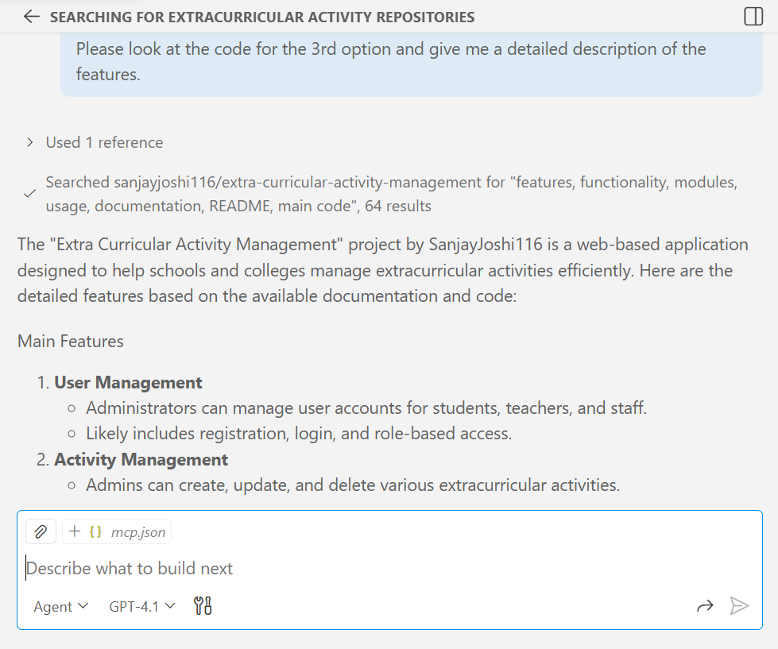
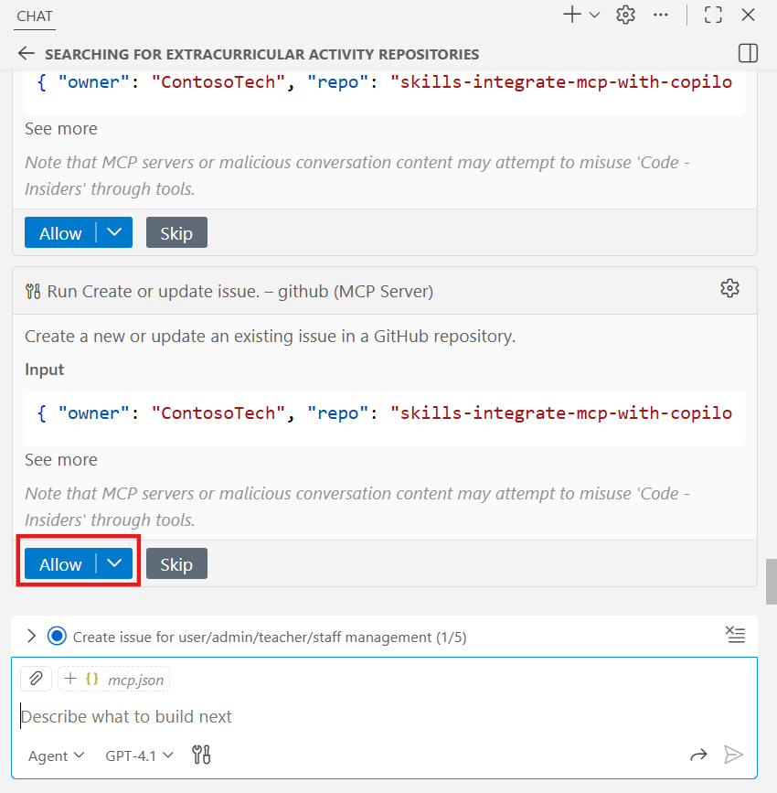
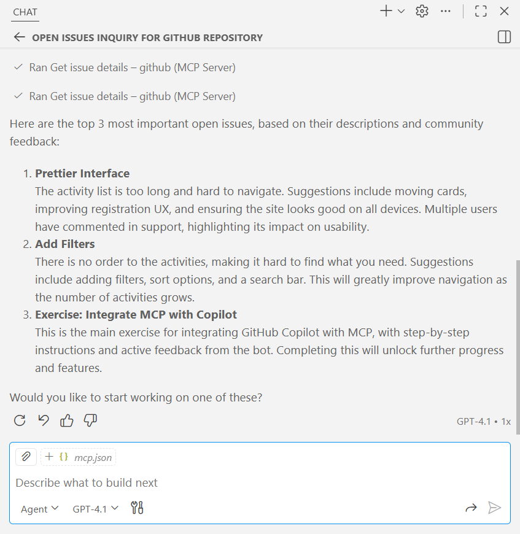

# Lab 07: Configure and use MCP Server in Copilot Chat

In this lab, you’ll learn how to set up and use a Model Context Protocol
(MCP) server with GitHub Copilot to enhance your development workflow.
You’ll work in a GitHub Codespace, connect Copilot to an MCP server, and
see how it can help with tasks like researching projects, creating
issues, implementing features, and opening pull requests. By the end,
you’ll understand how Copilot’s Agent mode can support real development
work from idea to delivery.

### Objectives:

- Integrate a GitHub MCP server with GitHub Copilot.

- Delegate Copilot to research similar projects and open issues.

- Ask Copilot to find an important issue and implement it from idea to
  pull request.

- Add comments to a recently closed issue.

### **Exercise 1: Get to know your environment**

1.  Sign in to your GitHub account.

2.  Browse to the following link: +++https://github.com/skills/integrate-mcp-with-copilot/+++ and
    click on **Use this template**.

    

3.  Select **Create a new repository** option.

    

4.  Keep the repository name as is and make sure the repository is set
    to be **Public**. Click on **Create repository**.

    

5.  Once you click on create repository, the new template will of the
    same repository will be created.

    

6.  Select the **Code** button and choose **Codespaces** option. Then,
    select **Create codespace on main** to open the codespace.

    

7.  Wait for about 9-10 mins to load all the dependencies.

    

8.  Navigate to **Extensions** tab from the left pane and validate
    the **Copilot Chat** and **Python** extensions are installed and
    enabled.

    

    

9.  Verify our application runs before modification. In the left
    sidebar, select the **Run and Debug** tab and then press the **Start
    Debugging** icon.

    

10. Within 15-20 seconds, you’ll receive a popup to open the application
    in the browser. Click on **Open in Browser**.

    

11. The application will be open in a new tab. You can review it.

    

### **Exercise 2: Add the GitHub MCP Server and connect it to GitHub copilot**

12. Inside your codespace, open the **Copilot Chat** panel.

    

13. Verify that the **Agent** mode is selected from the dropdown at the
    bottom of the chat.

    

14. Inside your codespace, navigate to the **.vscode** folder from the
    explorer, and **create a new file** by right-clicking on the folder.

    

15. Enter the name of the file as **mcp.json** and press **enter**.

    

16. Paste the following contents in the newly created file: **.vscode/mcp.json**

    ```
    {
    "servers": {
        "github": {
        "type": "http",
        "url": "https://api.githubcopilot.com/mcp/"
        }
    }
    }
    ```

    

17. In the **.vscode/mcp.json** file, click the **Start** button.

    

18. Accept the prompt to authenticate with GitHub. This has just
    informed GitHub Copilot of the MCP server's capabilities.

    

19. Select the account which you would like to use to authenticate this
    app. Select **Continue**.

    

20. Visual Studio is requesting additional permissions. Click on
    **Authorize Visual-Studio-Code.**

    

21. If the below window appears, you can close the window.

    

22. Switch to the codespace and you’ll see MCP server is now **running**.

    

23. In the Copilot side panel, click the 🛠️ **icon** to show the
    additional capabilities.

    

    

24. Navigate to **Source Control** tab from the left pane and write the
    **commit message** as +++update mcp.json+++. Then, **commit** the
    changes.

    

25. Click on **Yes** to stage all your changes and commit them directly.

    

26. Select **Sync Changes**.

    

27. Click **OK** to confirm.

    

Great work! You just connected your first MCP server to GitHub Copilot! 

### **Exercise 3: Quickly find and save ideas**

Let's put the GitHub MCP server to use by researching, comparing, and
capturing enhancement ideas!

28. **Note:** Ensure the Copilot Chat panel is open and Agent mode is
    selected. Verify the MCP server tools are also still available.

29. Ask Copilot to search GitHub for projects similar to this one and
    click on the **send** icon.

    +++Search for any other repositories for organizing extra curricular activities+++

    

30. Copilot will suggest you the similar projects.

    

31. Ask Copilot to describe one of the projects. Explore until you find
    something you like.

    +++Please look at the code for the 3rd option and give me a detailed
    description of the features.+++

    

32. Copilot will pick the suggested third project and generate the
    detailed description.

    

33. Use Copilot to compare and generate ideas for enhancements.

    +++Please compare these features to our project. Which would be new?+++

    

34. Copilot will share the compare the features to the new project.

    

35. Nice! Let's have Copilot create issues to save these ideas.

    +++I like it. Let's create issues for these in my repository.+++

    

36. Click on **Allow** button.

    

37. You can see copilot will give the confirmation that it created an issue.

    

38. Since we are done researching, let's finish this chat session to
    clear the context. At the top of the **Copilot Chat** panel, click
    the **New Chat** icon (plus sign).

    

### **Exercise 4: Solve issues with Agent Mode and GitHub MCP Server**

Not only did we find some new ideas to help organize extracurricular
activities, but we did all that quickly too. Now, let's use our MCP
server's tools and Copilot to do a bit of triage and get some work done.

39. Ensure the **Copilot Chat** panel is open and **Agent** mode is
    selected. Verify the **MCP server** tools are also still available.

40. Ask Copilot about the open issues on this repository.

    +++How many open issues are there on my repository?+++

    

41. Copilot will show the number of issues on the repository.

    

42. Ask Copilot to summarize the important issues:

    +++Oh no. That's too many for me! Please get the list of issues, review the descriptions and comments, and pick the top 3 most important.+++

    

43. Copilot will show you the top 3 issues.

    

44. With the list narrowed, ask Copilot to implement an issue. 

    ```
    #codebase Let's do the first one. Follow these steps:
    1. Checkout a new local branch for making our changes.
    2. Make the changes then confirm with me that they look correct.
    3. Push the changes and create a pull request.
    ```

    

45. Click on **Allow** button.

    

46. Wait until the final output is displayed and you’ll see the files
    that are affected. Click on **keep** button to keep the changes.

    

47. Navigate to **Source Control** tab and write **commit message** and
    then, **commit** the changes.

    

48. Click on **Yes** to stage all your changes and commit them directly.

    

49. Select **Publish Branch**.

    

50. Enter title as +++updated+++ and select **Create**.

    

51. Switch to the GitHub repository, you’ll see the pull request is created.

    

### **Exercise 5: Validating AI-generated code**

52. Open the **new pull request** created by Copilot in a new tab and
    select View pull request.

    

53. **Merge** the pull request.

    

54. Click on **Confirm** **merge**.

    

55. The changes are now merged.

    

56. Return to **VS code** and the active **Copilot Chat** session.

57. Ask Copilot to add a comment to the issue we just finished, and to
    say thanks for the comments and ideas.

    ```
    Add a closing comment to the issue we just finished. Provide a 1 sentence description of the implemented solution and thank the commenters for their ideas and feedback.
    ```

    

58. Click on **Allow**.

    

59. You’ll receive the output that a closing comment was added to the
    issue.

    

60. Now, navigate to the GitHub repository and select **Issues** tab. Select
    the closed issue.

    

61. You can see that the comment is now added to the issue.

    

## Conclusion

Nice work! By completing this lab, you’ve seen how powerful GitHub
Copilot becomes when it’s connected to an MCP server. You used Copilot
to explore similar projects, capture ideas as issues, prioritize work,
implement a feature, and even close the loop by commenting on a resolved
issue. This end-to-end experience shows how AI can move beyond just
writing code and start supporting your entire development workflow.
You’re now well-equipped to use these capabilities in your own projects
and take advantage of AI-assisted development in a practical, meaningful
way.
